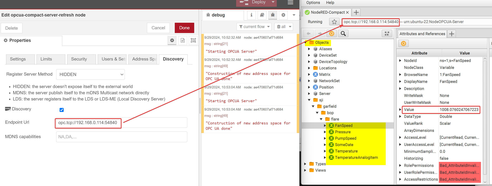

# node-red-contrib-opcua-server-refresh

A programmable OPC UA server for Node-RED based on node-opcua next generation version with less dependencies.

**NOTE:**
This is a fork of the original work of Klaus Landorf by Richard Meyer.  The original `node-red-contrib-opcua-server` package has not been maintained for over 2 years.  This updated version was created to work with the latest version of node opc-ua and its dependencies, as well as fix some broken/in progress features from the original project such as -
* loading of nodeset xml files from inside the node configuration
* full opc-ua security policy support

The goal of this projec is to be able to build modern node opc-ua servers within node-red that support most essential features.

## Core

using next generation node-opcua version from [Etienne Rossignon](https://github.com/erossignon/)

## Install

Run the following command in your Node-RED user directory - typically `~/.node-red`

        npm install node-red-contrib-opcua-server-refresh

try these options on npm install to build from source if you have problems to install

        --unsafe-perm --build-from-source

## Debug

Debugging on remote devices is important to help users. The verbose logging
provides interesting points in different abstractions if IDE or console debugging is not possible.

Start debug with Node-RED in verbose (-v) mode to get a verbose logging:

    DEBUG=opcuaCompact* node-red -v 1>Node-RED-OPC-UA-Server.log 2>&1

or on local Node-RED

    DEBUG=opcuaCompact* node red.js -v 1>Node-RED-OPC-UA-Server.log 2>&1

## Code Style

Prettier

## Quick Getting Started
A detailed example server showcasing various ways to construct nodes in OPC-UA is now included as part
of the default package.  The address space is pre-populated with a working nodes deployed in various formats,
along with notes to help understand the context.  
If you leave the deafult port number of `54840`, the only additional task is to define the endpoint.  
On the `Discovery` tab, populate the `Endpoint Url` with the format `opc.tcp:\\<node-red-ip>:54840`, as is shown here - 

Your server should be ready to go at this point. To view the contents of your server, there are numerous OPC-UA clients you can use.  If you don't have a preference, I recommend [Prosys OPC UA Browser](https://prosysopc.com/products/opc-ua-browser/) due its clean UI and ease of use.  It's free, but requires an email to get access to the file.

Once you have installed the OPC UA Browser of your choice, simply enter your endpoint url into the OPC UA client and press enter.  You will be prompted for security credentials, but since this server has security disabled by default, you can log in anonymously and set security to `none`.  You should be able to browse the server.
Your data will be located in the `Objects` path.  An example using the pre-defined code is shown - 
.

## Detailed Set-Up Information
For a more detailed, step-by-step guide on how to set up an OPC-UA server in node-red, I have written detailed guides hosted on flowfuse, split into 3 parts. You can find them here -
* [Part 1 - How to deploy a Basic OPC-UA Server in Node-Red](https://flowfuse.com/blog/2023/07/how-to-deploy-a-basic-opc-ua-server-in-node-red/)
* [Part 2 - How to Build a Secure OPC-UA Server with Data From a PLC in Node-Red](https://flowfuse.com/node-red/protocol/opa-ua/#building-secure-opc-ua-server-in-node-red.)
* [Part 3 - How to Build a OPC-UA Client Dashboard in Node-Red](https://flowfuse.com/blog/2023/07/how-to-build-a-opc-client-dashboard-in-node-red/)

### Loading a Nodeset Configuration File
To load a nodeset xml file, navigate to the `Users & Sets` tab, and enter the **absolute path** to the nodeset xml file.
This package comes pre-loaded with nodeset xml files in the `src/public/nodesets` directory.  So for example, if I want to load
the nodset xml file `Opc.Ua.AutoID.NodeSet2.xml`, for my set-up, the absolute path to that file would be `/root/.node-red/node_modules/node-red-contrib-opcua-server-refresh/src/public/nodesets/Opc.Ua.AutoID.NodeSet2.xml`. 
If you get an error `TypeError: Cannot read properties of null (reading 'objects')`, that means the server cannot find the nodeset file and you didn't enter the path correctly.
If the server can see the nodeset file, you can confirm it was loaded correctly by checking the `Types -> DataTypes -> XML Schema` path in a OPC UA Client browser - 

## Contribution

**Yes, sure!** Please help us to make it even better and send your pull requests or tests!

#### Happy coding!

## License

based on node-opcua we use MIT license
Copyright (c) 2019 [Bianco Royal Software Innovations®](https://github.com/BiancoRoyal/)
Forked and updated by Richard Meyer 2024
